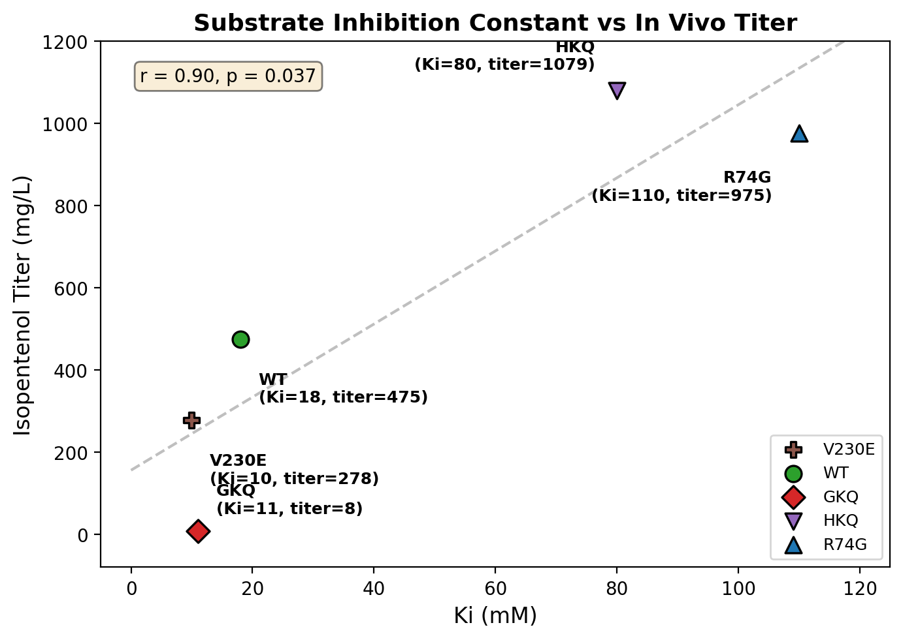
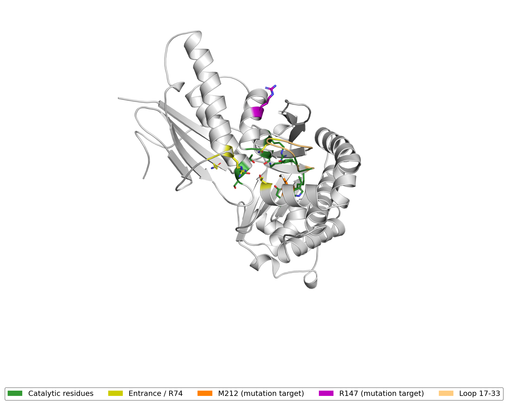
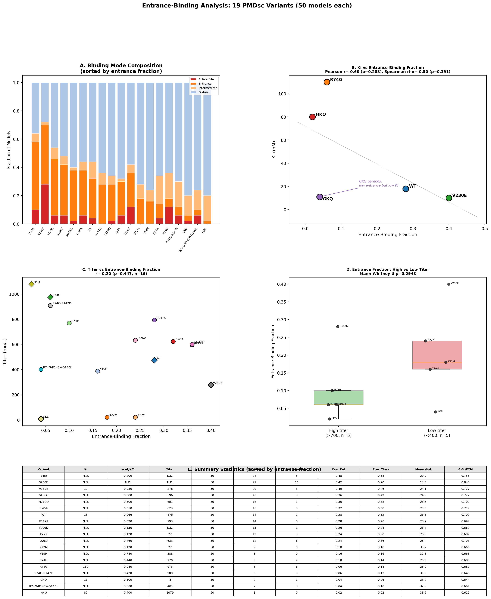
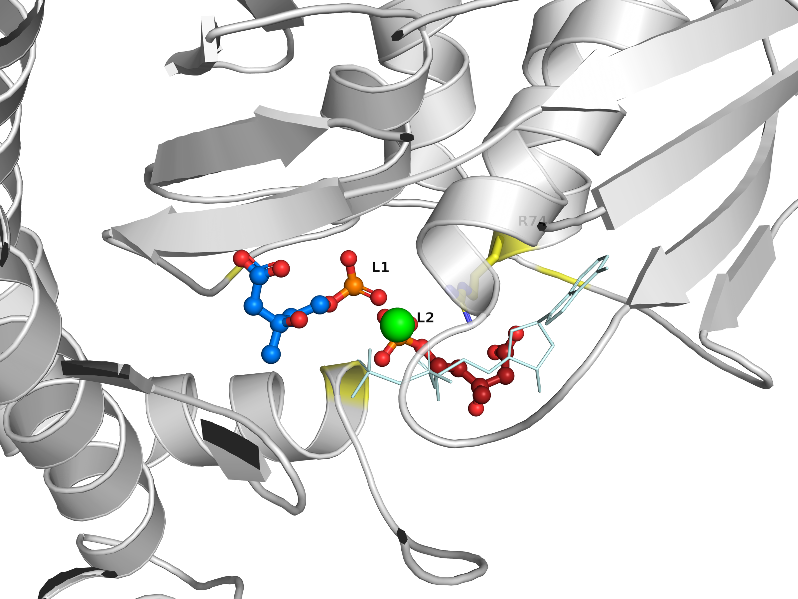
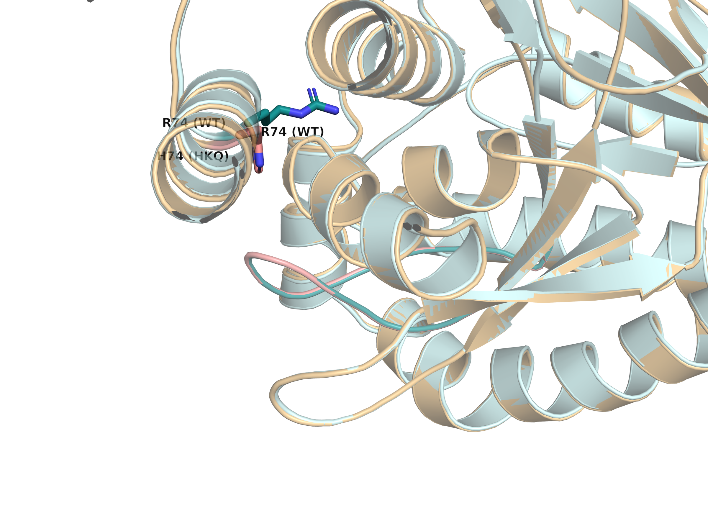
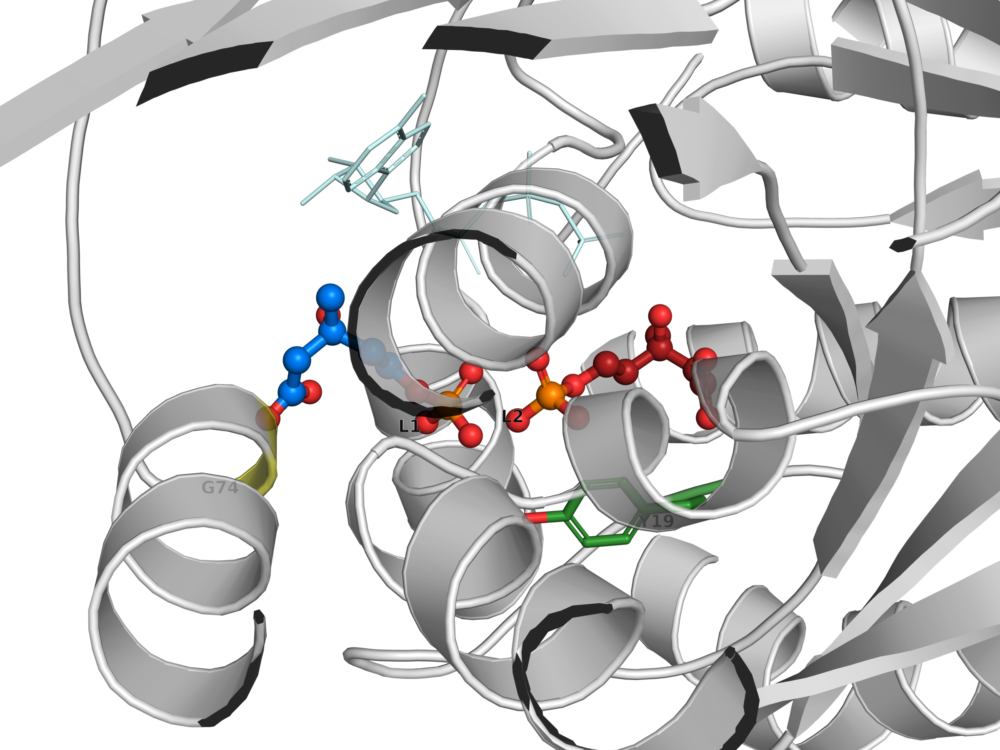
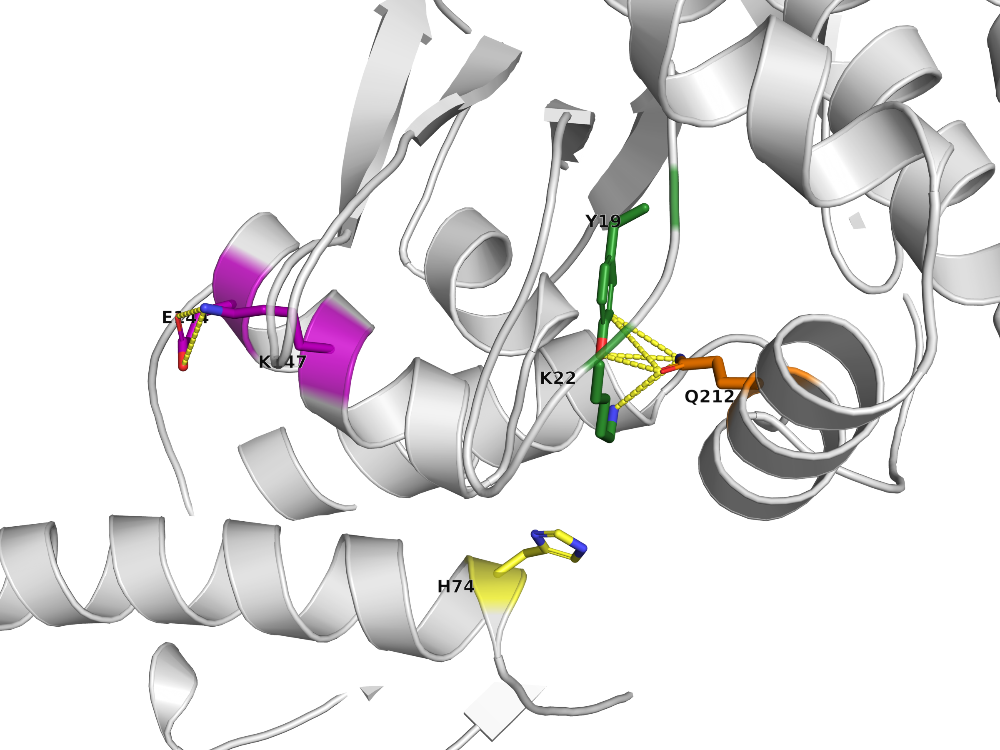
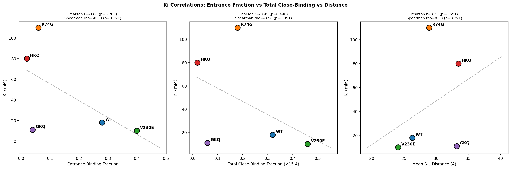
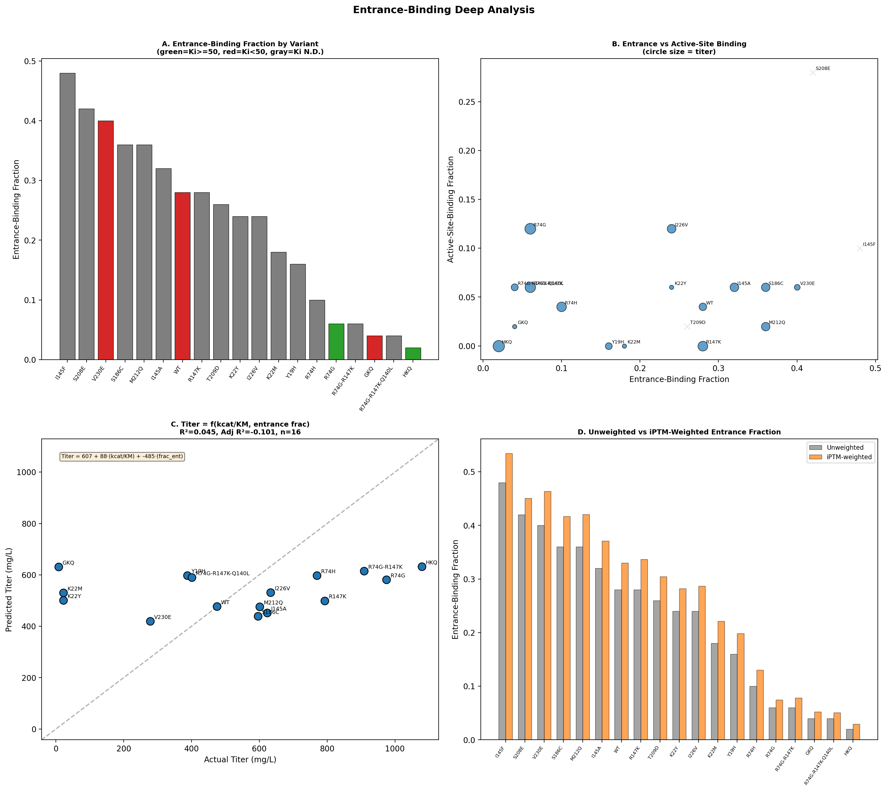

# Structural Basis of Substrate Inhibition in PMDsc

---

## 1. Why This Project Exists

Isopentenol is a biofuel precursor produced by engineered *E. coli* using the mevalonate (MVA) pathway. The conventional pathway produces isopentenyl diphosphate (IPP) as an intermediate, but IPP is toxic — at production-relevant concentrations it kills the host, capping titers.

The **IPP-bypass pathway** solves this by skipping IPP entirely:

```
Conventional:   Acetyl-CoA → → → Mevalonate → MVAP → MVAPP → IPP → Isopentenol
                                                                ↑ TOXIC

IPP-bypass:     Acetyl-CoA → → → Mevalonate → MVAP ──PMDsc──→ Isopentenol
                                                ↑ 100-200 mM in vivo
                                                  (substrate inhibition)
```

PMDsc (phosphomevalonate decarboxylase, *S. cerevisiae*) converts MVAP directly to isopentenol, but it was not evolved for this reaction — its native substrate is MVAPP. The enzyme has ~35-fold lower kcat and ~8-fold higher Km for MVAP versus MVAPP. Worse, at the high intracellular MVAP concentrations needed for production (100-200 mM), a second MVAP molecule binds somewhere on the enzyme and inhibits it. This **substrate inhibition** is now the primary bottleneck.

---

## 2. Substrate Inhibition and the Kinetic Data

In substrate inhibition, a second substrate molecule binds the enzyme at a secondary site and reduces activity:

```
             Vmax · [S]
  v = ─────────────────────
       Km + [S] + [S]²/Ki
```

Ki is the substrate inhibition constant. Larger Ki = weaker inhibition = more activity at high [S]. The inhibition can be **non-competitive** (secondary site distinct from active site) or **competitive** (second substrate competes for the active site).

Kang et al. (2017) showed that **Ki is the strongest predictor of in vivo titer** — more so than kcat/Km. This makes sense: at 100-200 mM intracellular MVAP (far above Km), the enzyme operates deep in the substrate-inhibited regime.

**Figure: Ki vs in vivo titer for the five variants with measured Ki.** The correlation is strong (Pearson r = 0.90, p = 0.037): variants with higher Ki (weaker substrate inhibition) produce more isopentenol. GKQ (Ki = 11, titer = 8) exemplifies how severe substrate inhibition can override good catalytic efficiency.



---

## 3. The 19 Variants

All kinetic data from Kang et al. (2017, 2019). Mutations span seven positions: Y19 (substrate-binding), K22 (loop 17-33 anchor), R74 (entrance gateway), I145 (helix H2 interior), R147 (helix H2 surface), S186, S208 (ATP-binding, catalytic), T209 (entrance contact), M212 (helix H4), I226, and V230 (helix H5).

| Variant | Mutations | kcat (s-1) | Km (mM) | kcat/Km (mM-1s-1) | Ki (mM) | Titer (mg/L) |
|---------|-----------|-----------|---------|-------------------|---------|--------------|
| WT | none | 0.15 | 2.3 | 0.066 | 18 | 475 |
| Y19H | Y19H | 0.27 | 0.35 | 0.78 | N.D. | 388 |
| K22M | K22M | 0.09 | 1.3 | 0.12 | N.D. | 22 |
| K22Y | K22Y | 0.09 | 1.3 | 0.12 | N.D. | 22 |
| R74G | R74G | 0.14 | 3.4 | 0.04 | 110 | 975 |
| R74H | R74H | 0.33 | 0.75 | 0.44 | N.D. | 770 |
| I145A | I145A | 0.029 | 2.0 | 0.01 | N.D. | 623 |
| I145F | I145F | 0.28 | 1.36 | 0.20 | N.D. | N.D. |
| R147K | R147K | 0.149 | 0.5 | 0.32 | N.D. | 793 |
| S186C | S186C | 0.07 | 0.8 | 0.08 | N.D. | 596 |
| S208E | S208E | N.D. | N.D. | N.D. | N.D. | N.D. |
| T209D | T209D | 0.13 | 0.99 | 0.13 | N.D. | N.D. |
| M212Q | M212Q | 0.35 | 0.7 | 0.50 | N.D. | 601 |
| I226V | I226V | 0.16 | 0.34 | 0.46 | N.D. | 633 |
| V230E | V230E | 0.07 | 0.8 | 0.08 | 10 | 278 |
| R74G-R147K | R74G-R147K | 0.22 | 0.53 | 0.42 | N.D. | 909 |
| HKQ | R74H-R147K-M212Q | 0.16 | 0.40 | 0.40 | 80 | **1079** |
| GKQ | R74G-R147K-M212Q | 0.22 | 0.50 | 0.50 | 11 | 8 |
| R74G-R147K-Q140L | R74G-R147K-Q140L | 0.06 | 2.0 | 0.03 | N.D. | 401 |

Key observations from the full dataset:

1. **Ki dominates titer, not kcat/Km.** R74G has the worst catalytic efficiency (0.04) but second-best titer (975), because its Ki is 110 mM. V230E has low Ki (10) and poor titer (278) despite adequate kcat/Km.

2. **The GKQ paradox.** R74G alone gives Ki = 110 (relief from inhibition). Adding R147K + M212Q to make GKQ drops Ki to 11 (severe inhibition) and collapses titer to 8. How can mutations that improve catalysis make inhibition dramatically worse?

3. **HKQ vs GKQ.** The only difference is position 74 — His vs Gly. Ki differs 7-fold (80 vs 11), titer 135-fold (1079 vs 8). Understanding this single residue is the key to the project.

4. **K22 mutations are catastrophic.** Both K22M and K22Y collapse titer to 22 mg/L despite modest kcat/Km (0.12). K22 is a primary anchor for MVAP in the active site — disrupting it impairs catalysis.

5. **Multi-mutant combinations with R74G reduce L2 binding.** R74G-R147K (12% close-binding, titer 909) and R74G-R147K-Q140L (10%, titer 401) both show reduced secondary binding, though Q140L addition hurts catalytic efficiency.

---

## 4. The Enzyme

PMDsc is a GHMP kinase superfamily member (PDB: 1FI4, 2.27 A apo structure, 396 residues). The active site accommodates MVAP, ATP, and Mg2+.

**Catalytic residues** (verified across five publications):
- D302 (catalytic base), R158 (facilitates decarboxylation)
- S121, S155, S208 (ATP binding)
- K18, Y19, W20, K22, S120, S153 (substrate binding)

The mutation targets span non-catalytic positions near the active site (R74, R147, M212, I145, I226, V230) and catalytic/substrate-binding positions (Y19, K22, S208, T209). Mutations at non-catalytic positions can alter Ki without necessarily destroying activity; mutations at catalytic positions directly affect substrate binding.

**Figure: PMDsc active site.** Catalytic residues (green sticks), entrance residues and R74 (yellow), mutation targets R147 (purple) and M212 (orange). Loop 17-33 highlighted in peach.



---

## 5. Computational Approach

We used Boltz-2 to cofold each of the 19 PMDsc variants with **two MVAP molecules** (plus ATP and Mg2+):
- **L1**: constrained to the active site via pocket conditioning
- **L2**: unconstrained — free to bind anywhere

L1 represents the catalytic substrate; L2, the inhibitory substrate. If Boltz-2 places L2 near L1, it has found the secondary binding site. We generated **50 models per variant (950 total)** and measured:

1. L2-L1 center-of-mass distance
2. Which protein residues L2 contacts (< 4 A)
3. Whether L2 binds at the entrance (non-competitive) or inside the active site (competitive)
4. A-L2 iPTM confidence for the L2 placement

We defined close binding as L2-L1 < 15 A. Single-MVAP Boltz-2 structures (5 models each for WT, Y19H, R74G, GKQ, and HKQ) served as references for analyzing R74-loop interactions and the Q212 bridge.

---

## 6. The Secondary Binding Site

### Two inhibition mechanisms

Boltz-2 reveals two distinct mechanisms by which L2 binds near the active site:

1. **Entrance binding** (non-competitive): L2 sits at the active-site mouth, contacting gateway residues (R74, K22, T209) but not deeply penetrating the catalytic pocket. This blocks substrate entry without competing for the catalytic site. Dominant in most variants with R74.

2. **Active-site binding** (competitive): L2 enters the active site itself, contacting 5+ catalytic residues and displacing L1. This requires the substrate to outcompete L1 for the same site, resulting in higher Ki. Dominant in G74 variants where the entrance anchor is absent.

Because these mechanisms have opposite Ki implications — entrance binding lowers Ki while active-site binding raises it — we use **entrance-binding fraction** as the primary metric rather than total close-binding fraction.

### L2 placement results (all 19 variants, sorted by entrance fraction)

| Variant | Ki (mM) | Entrance | Active-site | Total close | Mean dist (A) |
|---------|---------|----------|-------------|-------------|----------------|
| I145F | N.D. | **24/50 (48%)** | 5/50 (10%) | 29/50 (58%) | 20.9 |
| S208E | N.D. | 21/50 (42%) | 14/50 (28%) | 35/50 (70%) | 17.0 |
| V230E | 10 | **20/50 (40%)** | 3/50 (6%) | 23/50 (46%) | 24.1 |
| S186C | N.D. | 18/50 (36%) | 3/50 (6%) | 21/50 (42%) | 24.8 |
| M212Q | N.D. | 18/50 (36%) | 1/50 (2%) | 19/50 (38%) | 26.6 |
| I145A | N.D. | 16/50 (32%) | 3/50 (6%) | 19/50 (38%) | 25.8 |
| WT | 18 | 14/50 (28%) | 2/50 (4%) | 16/50 (32%) | 26.3 |
| R147K | N.D. | 14/50 (28%) | 0/50 (0%) | 14/50 (28%) | 28.7 |
| T209D | N.D. | 13/50 (26%) | 1/50 (2%) | 14/50 (28%) | 28.7 |
| I226V | N.D. | 12/50 (24%) | 6/50 (12%) | 18/50 (36%) | 26.4 |
| K22Y | N.D. | 12/50 (24%) | 3/50 (6%) | 15/50 (30%) | 28.6 |
| K22M | N.D. | 9/50 (18%) | 0/50 (0%) | 9/50 (18%) | 30.2 |
| Y19H | N.D. | 8/50 (16%) | 0/50 (0%) | 8/50 (16%) | 31.8 |
| R74H | N.D. | 5/50 (10%) | 2/50 (4%) | 7/50 (14%) | 28.6 |
| R74G | 110 | 3/50 (6%) | 6/50 (12%) | 9/50 (18%) | 28.9 |
| R74G-R147K | N.D. | 3/50 (6%) | 3/50 (6%) | 6/50 (12%) | 31.5 |
| R74G-R147K-Q140L | N.D. | 2/50 (4%) | 3/50 (6%) | 5/50 (10%) | 32.0 |
| GKQ | 11 | 2/50 (4%) | 1/50 (2%) | 3/50 (6%) | 33.2 |
| HKQ | 80 | **1/50 (2%)** | 0/50 (0%) | 1/50 (2%) | 33.5 |

**Key findings:**

- **Entrance-binding fraction better predicts Ki than total close-binding.** R74G has 18% total close-binding but only 6% entrance — most of its close models are active-site (competitive), which explains its high Ki (110). Using entrance fraction, the Ki correlation improves from r=-0.45 to r=-0.60.
- **V230E (Ki = 10, 40% entrance)** and **WT (Ki = 18, 28% entrance)** show high entrance binding consistent with their low Ki — the entrance trap is effective.
- **R74G (Ki = 110, 6% entrance)** has almost no entrance binding — the gate is open, so the inhibitor must compete for the active site (12% active-site), a much less effective inhibition mechanism.
- **HKQ (Ki = 80, 2% entrance)** effectively blocks L2 at the entrance — the door is closed.
- **GKQ (Ki = 11, 4% entrance)** remains paradoxical — low entrance binding but strong inhibition. Static structures do not capture the thermodynamic favorability of GKQ's entrance site (see GKQ Paradox section).
- **S208E (42% entrance, 28% active-site)** shows both mechanisms simultaneously — disrupting catalytic S208 creates a secondary binding site at the entrance AND opens the active site to L2.

**Figure: Entrance-binding analysis across all variants.** Binding mode composition, Ki vs entrance fraction, titer vs entrance fraction, and group comparison.



### Consensus contact residues

Across 271 close-binding models (from all 19 variants), L2 consistently contacts the same set of residues at the **active-site mouth**:

| Residue | Freq (of 271) | Role |
|---------|---------------|------|
| R/G/H74 | 216 (80%) | Gateway residue — anchors MVAP phosphate at entrance |
| K22 | 214 (79%) | Loop 17-33 anchor for MVAP phosphate (catalytic) |
| T209 | 213 (79%) | H-bond to phosphate, strongest non-catalytic contact |
| N28 | 166 (61%) | Loop 17-33 anchor |
| N72 | 153 (56%) | H-bonds MVAP carboxylate from opposite side |
| S153 | 136 (50%) | Catalytic residue flanking entrance |
| S208 | 127 (47%) | Catalytic residue flanking entrance |
| T25 | 126 (46%) | Loop 17-33 contact |
| G73 | 107 (39%) | Adjacent to R74 |
| G154 | 96 (35%) | Borders entrance channel |
| M/Q212 | 76 (28%) | Helix H4, participates in Q212 bridge in HKQ |
| Y/H19 | 66 (24%) | Substrate-binding residue |

The top three contacts — R74, K22, and T209 — are each contacted in ~80% of all close-binding models across all 19 variants, confirming their central role in defining the secondary binding site. Catalytic residues S153, S208, and S121 border the entrance but cannot be mutated without risking catalytic activity.


### Nature of the site

The secondary site is not a deep pocket — it is a shallow depression at the mouth of the active-site channel, where the incoming substrate pauses before entering. At normal concentrations, MVAP passes through this entrance into the active site. At saturating concentrations, a second MVAP occupies the entrance and blocks substrate turnover — non-competitive inhibition.

In variants with G74 (R74G, GKQ, R74G-R147K, R74G-R147K-Q140L), the entrance anchor is absent and L2 can instead enter the active site itself — competitive inhibition. This mode is rarer but represents a qualitatively different inhibition mechanism.

**Figure: Overview of the secondary binding site.** WT model with L1 (blue, active-site substrate) and L2 (red, inhibitor) at the entrance. Entrance residues (R74, N72, T209, N28, K22) highlighted yellow in the cartoon. R74 sidechain shown as yellow sticks.



---

## 7. Single-Mutation Effects on L2 Binding

The 14 single-mutant variants (beyond the original 5) reveal how individual positions contribute to secondary binding:

### Position 74: the entrance gateway

| Variant | Res 74 | Entrance % | Active-site % | Dominant mode | Ki | Titer |
|---------|--------|-----------|--------------|---------------|-----|-------|
| WT | Arg (R) | 28% | 4% | entrance | 18 | 475 |
| R74G | Gly (G) | 6% | 12% | active-site | 110 | 975 |
| R74H | His (H) | 10% | 4% | entrance | N.D. | 770 |

R74H alone reduces entrance-binding from 28% (WT) to 10%, confirming H74's entrance-closing effect even without R147K and M212Q. R74G switches the dominant binding mode from entrance to active-site (competitive) — only 6% entrance vs 12% active-site — explaining its uniquely high Ki.

### Position 22: loop 17-33 anchor

| Variant | Entrance % | Active-site % | Titer |
|---------|-----------|--------------|-------|
| WT | 28% | 4% | 475 |
| K22M | 18% | 0% | 22 |
| K22Y | 24% | 6% | 22 |

K22M reduces entrance-binding slightly (18%) while K22Y maintains WT-like levels (24%). Both collapse titer to 22 mg/L — K22's primary role is in catalysis, and its mutation destroys activity regardless of inhibition effects.

### Position 145: helix H2 interior

| Variant | Entrance % | Active-site % | kcat/Km | Titer |
|---------|-----------|--------------|---------|-------|
| I145A | 32% | 6% | 0.01 | 623 |
| I145F | 48% | 10% | 0.20 | N.D. |

I145F dramatically increases entrance-binding (48%, highest overall). The bulky Phe may reshape the entrance channel to favor L2 binding. I145A also increases entrance-binding (32%) despite minimal catalytic activity (kcat/Km = 0.01). Position 145 modulates L2 access but is not part of the entrance contact set.

### Position 147: helix H2 surface

R147K alone shows 28% entrance-binding (identical to WT) with 0% active-site binding, and achieves titer 793 — substantially better than WT (475). R147K's benefit appears to be primarily catalytic (kcat/Km improves from 0.066 to 0.32) rather than through L2 exclusion.

### Position 212: helix H4

M212Q alone shows 36% entrance-binding, higher than WT (28%). As a single mutation, M212Q does not reduce entrance binding — its inhibition-relieving effect requires coupling with H74 to form the Q212 bridge (see Section 10). Conversely, in the G74 background, Q212's free amide stabilizes L2 at the entrance, worsening inhibition (see Section 10, GKQ paradox).

### Entrance-adjacent positions

| Variant | Entrance % | Active-site % | Observation |
|---------|-----------|--------------|-------------|
| T209D | 26% | 2% | Replacing T209 with Asp slightly reduces entrance-binding from WT (28%). The negative charge may partially compensate for the lost hydroxyl. |
| S208E | 42% | 28% | Changing catalytic S208 to Glu produces the highest combined binding of any variant. Uniquely shows both mechanisms at high levels — disrupting this ATP-binding residue reorganizes the entire active-site pocket. |
| S186C | 36% | 6% | Higher entrance-binding than WT, suggesting S186 contributes to entrance geometry. |

### Distal positions

| Variant | Entrance % | Active-site % | Titer |
|---------|-----------|--------------|-------|
| I226V | 24% | 12% | 633 |
| V230E | 40% | 6% | 278 |

V230E (Ki = 10 mM) has the strongest measured substrate inhibition and shows 40% entrance-binding — entrance-dominant inhibition consistent with its very low Ki. I226V shows 24% entrance-binding with reasonable titer (633) but also 12% active-site binding.

---

## 8. The R74 Gateway Mechanism

Residue 74 sits at the entrance to the active site. The amino acid at this position controls access to the secondary binding site, but different amino acids use completely different physical mechanisms:

| Variant | Mutations | Res 74 | Res 74 — loop 17-33 contacts (mean across 5 models) | Mechanism | Ki |
|---------|-----------|--------|------------------------------------------------------|-----------|-----|
| WT | — | Arg (R) | 0 | Electrostatic anchor | 18 mM |
| Y19H | Y19H | Arg (R) | 0 | Same as WT | N.D. |
| R74G | R74G | Gly (G) | 0 | No sidechain — gate open | 110 mM |
| R74H | R74H | His (H) | **~21** | Physical closure | N.D. |
| GKQ | R74G-R147K-M212Q | Gly (G) | 0 | No sidechain — gate open (see Section 10) | 11 mM |
| HKQ | R74H-R147K-M212Q | His (H) | **21** | Physical closure | 80 mM |

### R74 — Arginine (WT): the electrostatic trap

Arginine has a long, flexible sidechain ending in a positively charged guanidinium. It does not physically contact loop 17-33 (0 contacts). Instead, it provides an electrostatic anchor for the negatively charged MVAP phosphate at the entrance — a hydrogen bond at 2.3 A. The entrance is an effective substrate trap. Ki = 18 mM.

### G74 — Glycine (R74G): the open gate

Glycine has no sidechain. The electrostatic anchor is gone, and L2 cannot stably bind at the entrance. However, the gate is wide open — L2 can sometimes enter the active site itself (see Section 9). Ki = 110 mM, but through a fundamentally different inhibition mechanism.

### H74 — Histidine (R74H and HKQ): the closed door

Histidine has a shorter, bulkier imidazole ring. Unlike arginine, which attracts the substrate from a distance, histidine makes **21 direct van der Waals contacts** with loop residues T25, K26, and N28 — physically pushing the loop closed over the entrance. The door is shut.

The effect is visible even in the single mutant: R74H alone reduces close-binding from 32% (WT) to 14%. In HKQ, with the added Q212 bridge and K147 salt bridge, L2 reaches the secondary site in only 1 of 50 models (2%).

### The key distinction

R74 (Arg) and H74 (His) both modulate substrate inhibition, but through opposite physics. R74 attracts the substrate (providing a stable trap at the entrance). H74 physically blocks the substrate (closing the door). H74's mechanism is more effective for production: a closed door prevents inhibition entirely, whereas a trap still holds the inhibitor in place.

**Figure: The R74 gateway mechanism.** Superposition of WT (teal cartoon, R74 as teal sticks) and HKQ (salmon cartoon, H74 as salmon sticks). Loop 17-33 is highlighted in both structures. H74's bulky imidazole pushes the loop closed over the entrance, while R74's long sidechain extends outward.




---

## 9. R74G and Competitive Inhibition

R74G's close-binding models are qualitatively different from entrance-binding models. L2 does not sit at the entrance — it enters the active site itself, contacting **10 catalytic residues** (K18, Y19, W20, K22, S121, S153, S155, R158, S208, D302) and displacing L1 from its normal position.

This is **competitive inhibition**: the second MVAP competes for the same binding pocket as the first. With 50 models, R74G shows 6 active-site models (12%) — the highest active-site fraction among single-mutant variants. Competitive inhibition requires much higher substrate concentrations (the inhibitor must outcompete the catalytic substrate for the same site), which explains R74G's high Ki of 110 mM.

The competitive mode is a consistent feature of all G74-containing variants:

| Variant | Active-site models | Entrance models | Total close |
|---------|-------------------|-----------------|-------------|
| R74G | 6 (12%) | 3 (6%) | 9 (18%) |
| R74G-R147K | 3 (6%) | 3 (6%) | 6 (12%) |
| GKQ | 1 (2%) | 2 (4%) | 3 (6%) |
| R74G-R147K-Q140L | 3 (6%) | 2 (4%) | 5 (10%) |

All G74 variants show active-site binding, whereas WT (with R74) shows only 2 active-site models (4%) out of 16 close-binding models. S208E is the exception — it shows 14 active-site models (28%) despite retaining R74, reflecting the disrupted active-site geometry from the S208E mutation.

**Figure: Competitive binding in R74G.** L1 (blue) and L2 (red) both occupy the active-site pocket. G74 (yellow) has no sidechain to block entry; Y19 (green) marks the catalytic site. L2 competes directly with L1 for the same binding site.



---

## 10. The GKQ Paradox

This is the most important puzzle in the dataset:

- **R74G alone**: Ki = 110, titer = 975 (relief from inhibition)
- **R74G + R147K (double)**: titer = 909 (close-binding = 12%, still good)
- **R74G + R147K + M212Q (GKQ)**: Ki = 11, titer = 8 (severe inhibition)
- **R74H + R147K + M212Q (HKQ)**: Ki = 80, titer = 1079 (best overall)

How can adding M212Q to R74G-R147K — a mutation that alone does not increase inhibition — cause Ki to plummet from ~high to 11? And why does the same triple combination work with R74H?

The expanded dataset helps dissect this. Single-mutant contributions:

| Single mutant | Close-binding | Effect on L2 |
|---------------|---------------|--------------|
| R147K alone | 28% (vs WT 32%) | Slight reduction |
| M212Q alone | 38% (vs WT 32%) | Slight increase |
| R74G alone | 18% | Switches to competitive mode |

R147K modestly reduces L2 binding. M212Q slightly increases it. Neither alone explains GKQ's catastrophic Ki. The synergy is structural.

### The Q212 bridge

M212Q introduces glutamine at position 212. In **HKQ**, Q212 forms a hydrogen-bond bridge connecting two critical structural elements:

- **Q212.OE1 — Y19.OH**: 2.72 A (tethers helix H4 to the substrate-binding domain)
- **Q212.OE1 — K22.NZ**: 2.79 A (tethers helix H4 to loop 17-33)

This bridge locks loop 17-33 in position, preventing it from opening to accommodate L2. Combined with H74's 21 contacts, HKQ has a doubly secured entrance — closed door + locked loop.

In **GKQ**, despite carrying the **identical M212Q mutation**, this bridge does not form. Q212-Y19 and Q212-K22 distances are above hydrogen-bond cutoff (6+ A). The critical difference is position 74: without H74's contacts to the loop, the entrance region adopts a different conformation — one where Q212 cannot reach its bridging partners. The conformational effect of G74 vs H74 propagates through the entrance geometry to determine whether the Q212 bridge can form.

### The K147 salt bridge

R147K also behaves differently between variants. In HKQ, K147 forms a salt bridge with E144 on helix H2 (2.5 A), stabilizing the helix. In GKQ, K147 points away from E144 toward H176 instead.

**Figure: The Q212 bridge in HKQ.** Q212 (orange) forms hydrogen bonds (yellow dashes) to Y19 and K22 (green), locking loop 17-33. H74 (yellow) provides physical closure. K147-E144 salt bridge (purple, magenta dashes) stabilizes helix H2.



### Why GKQ fails

In GKQ, G74 leaves the entrance open (no physical barrier), the Q212 bridge does not form (loop 17-33 is not locked), and R147K + M212Q restore the entrance site that R74G alone had disrupted. The result is Ki = 11 mM — worse even than WT.

GKQ has good catalytic efficiency (kcat/Km = 0.5) because R147K and M212Q optimize the active-site geometry. But the same changes also restore the inhibitory entrance site, and G74 provides no barrier. A fast enzyme that is easily inhibited — the worst possible combination for in vivo production.

However, the structural explanation above only tells half the story. GKQ's entrance-binding fraction from Boltz-2 cofolding is just 4% — lower than WT (28%). If entrance accessibility were the sole determinant of Ki, GKQ should have high Ki, not low. The resolution requires distinguishing geometric accessibility from thermodynamic affinity: in GKQ, Q212's free amide group directly contacts and stabilizes L2 when it visits the entrance, making the site thermodynamically favorable despite being geometrically rare. This frequency ≠ affinity distinction is analyzed in detail in Section 12.

### The R74G-R147K intermediate

R74G-R147K (without M212Q) achieves titer 909 — nearly as good as R74G alone (975). Its close-binding fraction (12%) is lower than R74G (18%), and it has good catalytic efficiency (kcat/Km = 0.42). This suggests that adding R147K to R74G is beneficial: it improves catalysis without fully restoring the entrance site. The catastrophic step is adding M212Q to this background, which in the absence of H74 cannot form the protective bridge and instead contributes to entrance restoration.


---

## 11. Why HKQ Wins

HKQ (R74H-R147K-M212Q) achieves the best titer (1079 mg/L) because it solves both engineering challenges simultaneously.

**Catalytic efficiency**: R147K and M212Q improve kcat/Km from 0.066 (WT) to 0.4 — a 6-fold gain.

**Substrate inhibition resistance**: A triple defense at the entrance site:

1. **H74 closes the entrance** — 21 contacts to loop 17-33 physically seal the channel mouth
2. **Q212 bridge locks the loop** — H-bonds to Y19 and K22 prevent the loop from reopening
3. **K147-E144 salt bridge** — stabilizes helix H2, adding rigidity to the entrance region

The result: only 1/50 Boltz-2 models places L2 near the active site. Ki = 80 mM.

HKQ's Ki (80) is lower than R74G's (110) because R74G eliminates the entrance site entirely (no anchor), while HKQ merely closes it (the site still exists, just blocked). Under extreme conditions, the entrance might still open transiently. But for in vivo production, HKQ's combination of good catalysis and strong Ki is far superior to R74G's high Ki with poor catalysis.

### Ranking all variants by entrance exclusion

| Rank | Variant | Entrance % | Active-site % | Ki | kcat/Km | Titer |
|------|---------|-----------|--------------|-----|---------|-------|
| 1 | HKQ | 2% | 0% | 80 | 0.40 | **1079** |
| 2 | GKQ | 4% | 2% | 11 | 0.50 | 8 |
| 3 | R74G-R147K-Q140L | 4% | 6% | N.D. | 0.03 | 401 |
| 4 | R74G | 6% | 12% | 110 | 0.04 | 975 |
| 4 | R74G-R147K | 6% | 6% | N.D. | 0.42 | 909 |
| 6 | R74H | 10% | 4% | N.D. | 0.44 | 770 |
| 7 | Y19H | 16% | 0% | N.D. | 0.78 | 388 |
| 8 | K22M | 18% | 0% | N.D. | 0.12 | 22 |
| 9 | I226V | 24% | 12% | N.D. | 0.46 | 633 |
| 9 | K22Y | 24% | 6% | N.D. | 0.12 | 22 |
| 11 | T209D | 26% | 2% | N.D. | 0.13 | N.D. |
| 12 | WT | 28% | 4% | 18 | 0.066 | 475 |
| 12 | R147K | 28% | 0% | N.D. | 0.32 | 793 |
| 14 | I145A | 32% | 6% | N.D. | 0.01 | 623 |
| 15 | M212Q | 36% | 2% | N.D. | 0.50 | 601 |
| 15 | S186C | 36% | 6% | N.D. | 0.08 | 596 |
| 17 | V230E | 40% | 6% | 10 | 0.08 | 278 |
| 18 | S208E | 42% | 28% | N.D. | N.D. | N.D. |
| 19 | I145F | 48% | 10% | N.D. | 0.20 | N.D. |

The best production variants combine low entrance-binding with adequate kcat/Km: HKQ (2% entrance, 0.40), R74G-R147K (6% entrance, 0.42), and R74H (10% entrance, 0.44). Note that R74G now correctly ranks alongside other G74 variants at 6% entrance despite its 18% total close-binding — the distinction between entrance (non-competitive) and active-site (competitive) binding resolves the apparent inconsistency between R74G's low close-binding rank and its high Ki (110).

| Variant | Entrance anchor | Loop closure | Q212 bridge | Ki | kcat/Km | Titer |
|---------|----------------|-------------|-------------|-----|---------|-------|
| WT | Strong (R74) | None | No | 18 | 0.066 | 475 |
| Y19H | Strong (R74) | None | No | N.D. | 0.78 | 388 |
| R74G | None (G74) | None | No | 110 | 0.04 | 975 |
| R74H | Closed (H74) | ~21 contacts | No | N.D. | 0.44 | 770 |
| R74G-R147K | None (G74) | None | No | N.D. | 0.42 | 909 |
| GKQ | None (G74) | None | No (despite M212Q) | 11 | 0.5 | 8 |
| HKQ | Closed (H74) | 21 contacts | Yes | 80 | 0.4 | **1079** |

---

## 12. Correlations and Statistical Analysis

### Ki prediction by inhibition mechanism (n = 5)

The entrance-binding analysis correctly predicts Ki for 4 of 5 variants with measured Ki values:

| Variant | Entrance % | Active-site % | Dominant mechanism | Ki (mM) | Prediction |
|---------|-----------|--------------|-------------------|---------|------------|
| V230E | 40% | 6% | non-competitive | 10 | high entrance → low Ki ✓ |
| WT | 28% | 4% | non-competitive | 18 | moderate entrance → moderate Ki ✓ |
| HKQ | 2% | 0% | blocked | 80 | no entrance → high Ki ✓ |
| R74G | 6% | 12% | competitive | 110 | competitive-dominant → highest Ki ✓ |
| GKQ | 4% | 2% | see below | 11 | should be high Ki → **wrong** ✗ |

The hypothesis correctly rank-orders Ki for the 4 non-GKQ variants: V230E (Ki=10) < WT (Ki=18) < HKQ (Ki=80) < R74G (Ki=110), matching the entrance fraction ordering V230E (40%) > WT (28%) > R74G (6%) > HKQ (2%). The mechanism classification also resolves why R74G has the highest Ki despite moderate total close-binding: its inhibition is competitive (active-site dominant), which requires much higher substrate concentrations than non-competitive (entrance) inhibition.

### The GKQ paradox explained: frequency ≠ affinity

GKQ is the sole outlier: 4% entrance-binding but Ki = 11. Section 10 explains the structural basis — the Q212 bridge fails to form in the G74 background. Here we add the thermodynamic dimension: the resolution lies in the distinction between **geometric accessibility** (how often L2 lands at the entrance — what Boltz-2 measures) and **thermodynamic stability** (how tightly L2 binds once there — what Ki reflects).

The critical mutation is M212Q. In GKQ's 3 close-binding models, Q212 is contacted in 2 of 3 — it directly contacts L2 at the entrance. In GKQ, Q212 cannot form the protective Y19-K22 bridge (because G74 doesn't push the loop into bridging position), so Q212's amide group is *free*. When L2 visits the entrance, this free Q212 provides hydrogen bonds that stabilize L2 binding.

M212Q has opposite effects depending on position 74:

| Context | Q212 role | Effect on Ki |
|---------|-----------|-------------|
| With H74 (HKQ) | Bridges Y19-K22, locks loop closed | **Raises Ki** (blocks entrance) |
| With G74 (GKQ) | Free amide contacts L2 directly | **Lowers Ki** (stabilizes L2 binding) |

Supporting evidence:
- **R74G-R147K (titer=909)**: same as GKQ but without M212Q — M212 is methionine (no H-bond donor), so L2 cannot be stabilized at the entrance. Adding M212Q is the catastrophic step.
- **R74G-R147K-Q140L (titer=401, 4% entrance)**: Q140L is on helix H2, far from entrance contacts. It doesn't stabilize L2 binding the way Q212 does, so titer is 50x better than GKQ despite identical entrance fraction.
- **M212Q alone (36% entrance, titer=601)**: with R74 still present, the electrostatic anchor dominates. Q212's stabilization effect is masked.

The GKQ paradox is not a failure of the entrance-binding model — it reveals its boundary. Boltz-2 correctly captures geometric accessibility but not binding affinity. GKQ's entrance site is geometrically rare (4%) but thermodynamically favorable (Q212 stabilization). Predicting Ki quantitatively for cases like GKQ would require free energy calculations (FEP/TI) or experimental binding assays.

### Correlation statistics

| Metric | Pearson r | p-value |
|--------|-----------|---------|
| Ki vs **entrance fraction** | **-0.60** | 0.28 |
| Ki vs total close-binding | -0.45 | 0.45 |
| Ki vs mean distance | 0.33 | 0.59 |

Entrance-binding fraction improves the Ki correlation from r=-0.45 to r=-0.60. The Pearson r is dragged down by GKQ; without it (n=4), the rank ordering is perfectly monotonic. With only n=5 Ki measurements, neither correlation reaches statistical significance — measuring Ki for R74H, R147K, and M212Q would substantially improve power.

**Figure: Ki correlation analysis.** Entrance fraction (left) vs total close-binding (center) vs mean distance (right).



### Group comparison: high-titer vs low-titer variants

Splitting variants into high-titer (>=700 mg/L: R74G, R74H, R147K, R74G-R147K, HKQ; n=5) vs low-titer (<400 mg/L: Y19H, K22M, K22Y, V230E, GKQ; n=5):

| Metric | High-titer mean | Low-titer mean | Mann-Whitney p |
|--------|----------------|----------------|----------------|
| Entrance fraction | 0.104 | 0.204 | 0.295 |
| Mean entrance contacts | 9.7 | 7.5 | 0.095 |

High-titer variants have roughly half the entrance-binding fraction of low-titer variants (10.4% vs 20.4%). The trend in mean entrance contacts (p=0.095) suggests that when L2 does bind at the entrance in high-titer variants, it makes more contacts — possibly reflecting a more structured (and thus more blockable) entrance site.

### Titer regression model

A multivariate model combining kcat/Km and entrance fraction: titer = 607 + 88·(kcat/KM) - 485·(entrance fraction). R² = 0.045 (n=16) — titer is poorly predicted by these two variables alone, confirming that expression level, protein stability, and cellular context dominate titer determination beyond Ki and catalytic efficiency.

**Figure: Entrance-binding deep analysis.** Entrance fraction by variant, entrance vs active-site binding scatter, titer model, and iPTM-weighted entrance fractions.



---

## 13. Proposed Mutations

Based on the expanded secondary site contacts (271 close-binding models across 19 variants), the three highest-frequency non-catalytic contacts remain the primary targets:

| Priority | Mutation | Contact freq | Rationale |
|----------|----------|-------------|-----------|
| 1 | T209A or T209V | 213/271 (79%) | Disrupts strongest non-catalytic H-bond to MVAP phosphate. T209D retains 28% close-binding, suggesting the negative charge partially compensates. Non-polar replacement preferred. Caution: adjacent to catalytic S208 — validate that S208 positioning is not perturbed. |
| 2 | N72A or N72V | 153/271 (56%) | Disrupts H-bond to MVAP carboxylate from opposite side of entrance. |
| 3 | N28A or N28V | 166/271 (61%) | Disrupts loop 17-33 anchoring of L2. Higher frequency than N72 but loop perturbation risk is higher. |

The ideal next-generation variant would combine HKQ's entrance closure mechanisms with one or more of these entrance-disrupting mutations, while validating that catalytic efficiency (kcat/Km >= 0.4) is maintained.

Additional insights from the expanded dataset:
- **Avoid position 145 mutations** in the HKQ background: I145F increases close-binding to 58%, suggesting I145 helps maintain the entrance geometry that H74 closes.
- **V230E as negative control**: V230E's combination of high close-binding (46%) and low Ki (10) makes it a useful negative control — any successful mutation should move away from V230E's phenotype.
- **S208E is informative but not druggable**: S208 is catalytic. The 70% close-binding in S208E confirms that active-site geometry directly influences L2 binding.

---

## 14. Limitations

1. **Sample size and power**: 50 models per variant (950 total) provides statistically meaningful entrance-binding fractions. Ki correlations (n = 5 variants with measured Ki) remain underpowered — Pearson r = -0.60 (p = 0.28) for entrance fraction shows the expected trend but cannot reach significance. The hypothesis correctly rank-orders Ki for 4 of 5 variants; GKQ is the sole outlier (explained by frequency ≠ affinity, Section 12).
2. **Geometric accessibility ≠ thermodynamic affinity**: Boltz-2 captures where L2 *can* land (frequency) but not how tightly it binds (affinity). GKQ exemplifies this: 4% entrance-binding but Ki = 11, because Q212 stabilizes the rare binding events. Predicting Ki quantitatively for such cases would require free energy calculations (FEP/TI).
3. **No dynamics**: Boltz-2 produces static structures. The entrance may open/close on timescales not captured here. A residue with 21 contacts in a static structure might have fewer in solution.
4. **No binding energies**: We identify the site, its contacts, and the dominant inhibition mechanism, but cannot estimate L2 binding affinity or quantitatively predict Ki.
5. **Missing Ki data**: Only 5 of 19 variants have measured Ki values. Measuring Ki for R74H, R147K, M212Q, I145F, and I145A would substantially improve the power of correlation analyses and test the entrance-binding hypothesis more rigorously.
6. **Titer confounders**: Titer depends on expression level, protein stability, and cellular context beyond Ki and kcat/Km. The weak titer-entrance correlation (r = -0.21) partly reflects these confounders — titer cannot be predicted from structural metrics alone.

---

## 15. File Index

```
PMD/
├── structures/
│   ├── PDB/
│   │   ├── 1FI4_clean.pdb                     # WT crystal structure (2.27 A, apo)
│   │   └── 1FI4_catalytic_residues.md          # Verified catalytic residues
│   │
│   ├── sequences/                              # FASTA files for all variants
│   │
│   └── boltz2/
│       ├── best_structures/                    # Best 1-MVAP models per variant
│       ├── output/                             # Full 1-MVAP Boltz-2 output (5 variants)
│       └── output_2mvap/                       # Two-MVAP cofolding (key data)
│           ├── PMDsc_{variant}_2mvap/          # 50 models per variant (19 variants)
│           ├── comprehensive_l2_analysis_all.py     # Analysis script (all 19 variants)
│           ├── comprehensive_l2_analysis_all.json   # Numerical results
│           ├── comprehensive_l2_analysis_all.png    # Main entrance-binding figure
│           ├── ki_correlation_all.png               # Ki correlation figure
│           ├── entrance_analysis_all.png            # Entrance deep analysis figure
│           └── structural_insights.py/json          # Earlier structural analysis
│
├── analysis/
│   ├── comprehensive_guide.md                  # This document
│   ├── comprehensive_guide.pdf                 # PDF version
│   ├── generate_report_figures.py              # Data figure generation
│   ├── generate_struct_figures.py              # Structural figure generation (PyMOL)
│   ├── generate_struct_panels.py               # Enzyme overview + variant panels
│   ├── fig3,5,6.png                            # Data analysis figures
│   ├── struct_*.png                            # Structural figures (6 total)
│
└── md/                                         # Molecular dynamics (in progress)
```

---

## References

1. Kang A, et al. "Isopentenyl diphosphate (IPP)-bypass mevalonate pathways for isopentenol production." *Metab Eng* (2019).
2. Kang A, et al. "Substrate specificity and engineering of mevalonate 5-phosphate decarboxylase." *ACS Chem Biol* (2017).
3. Chen CL, et al. "Visualizing the enzyme mechanism of mevalonate diphosphate decarboxylase." *Nat Commun* (2020).
4. Barta ML, et al. "Structural basis for nucleotide binding and reaction catalysis in mevalonate diphosphate decarboxylase." *Biochemistry* (2012).
5. Michihara A, et al. "Identification of active site residues in mevalonate diphosphate decarboxylase." (2008).
