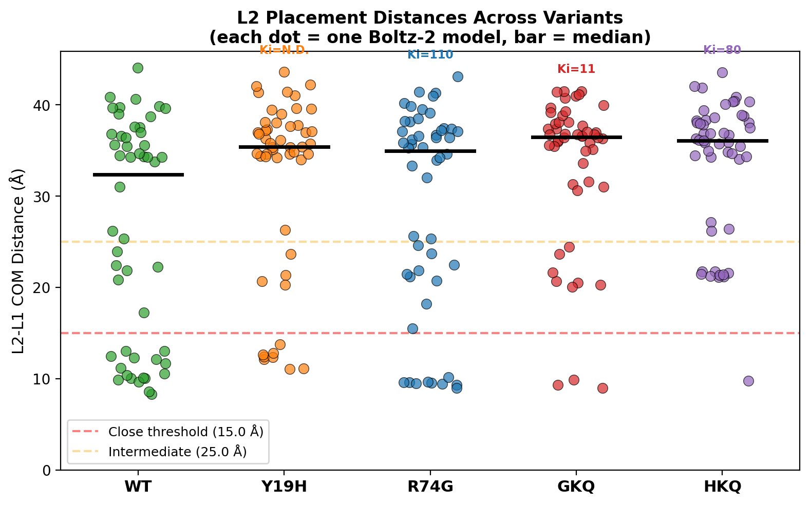
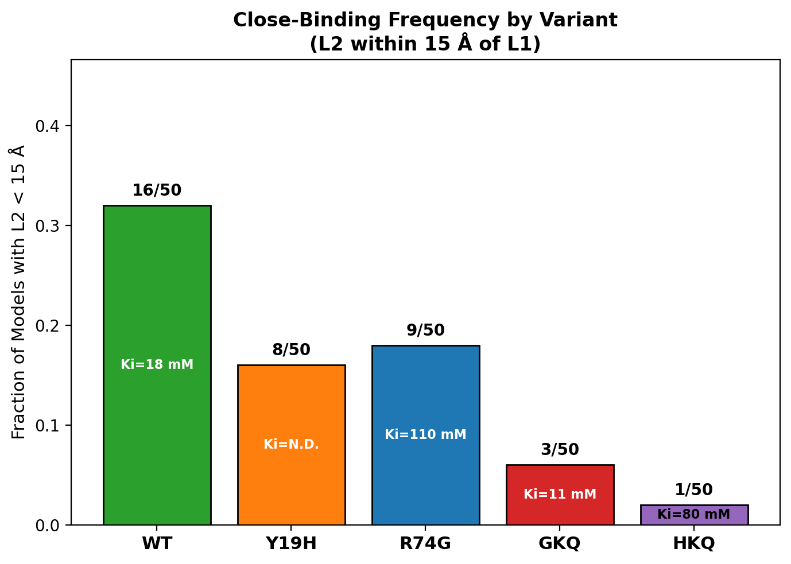
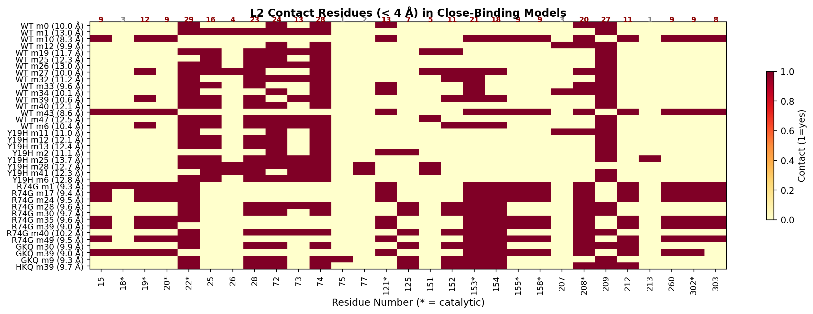
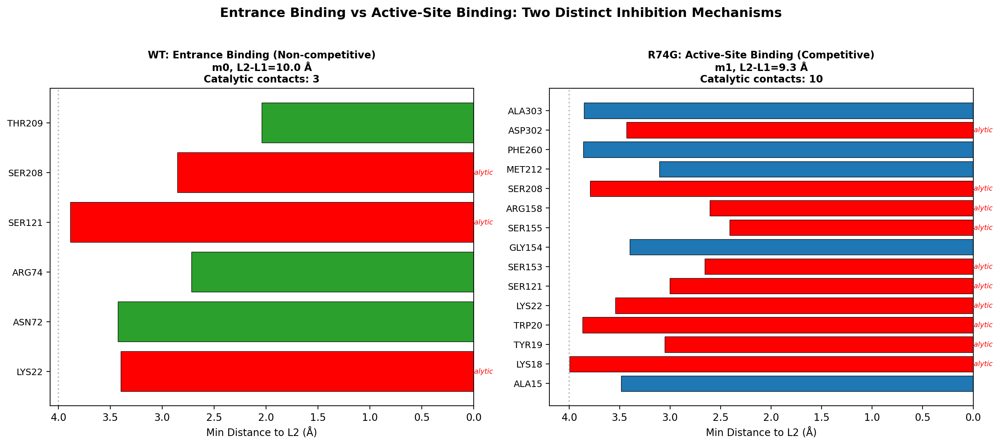
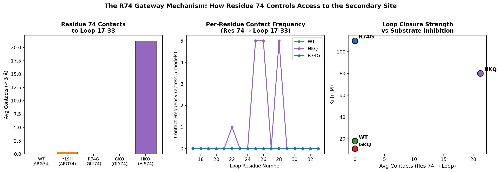
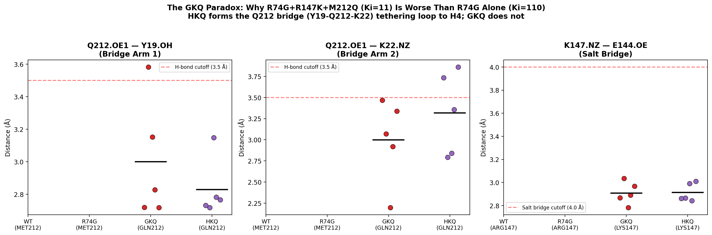
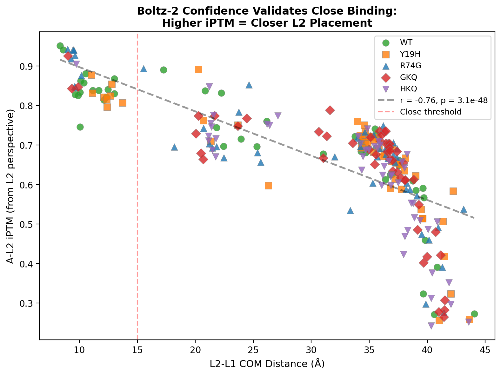

# Structural Analysis of Substrate Inhibition in PMDsc

## 1. Executive Summary

- **A secondary MVAP binding site exists at the active-site entrance**, formed by residues R74, K22, N28, N72, and T209. This site is distinct from the catalytic pocket and consistent with non-competitive inhibition.
- **Residue 74 acts as a gateway**: R74 (Arg) provides electrostatic shielding; H74 (His, in HKQ) physically closes the entrance with 21 contacts to loop 17-33; G74 (Gly, in R74G) leaves the gate open but eliminates the MVAP phosphate anchor.
- **The GKQ paradox is explained by the Q212 bridge**: In HKQ, Q212 bridges Y19 and K22 (2.7-2.8 Å), tethering the substrate-binding loop to the H4 helix. This bridge is absent in GKQ despite the identical M212Q mutation.
- **Boltz-2 confidence validates the findings**: A-L2 iPTM strongly anti-correlates with L2-L1 distance (r = -0.85), confirming that close placements are not random.

---

## 2. Background

PMDsc (phosphomevalonate decarboxylase from *Staphylococcus carnosus*) catalyzes the conversion of mevalonate 5-phosphate (MVAP) to isopentenol in the IPP-bypass mevalonate pathway. At high intracellular MVAP concentrations (~100-200 mM), a second MVAP molecule binds an allosteric site and inhibits the enzyme (substrate inhibition).

The substrate inhibition constant Ki is the strongest predictor of in vivo isopentenol titer (Kang et al. 2017). High Ki (weak inhibition) combined with high kcat/Km (good catalysis) yields the best production.

| Variant | Mutations | kcat/Km (mM⁻¹s⁻¹) | Ki (mM) | Titer (mg/L) |
|---------|-----------|-------------------|---------|--------------|
| WT | none | 0.066 | 18 | 475 |
| Y19H | Y19H | 0.78 | N.D. | 388 |
| R74G | R74G | 0.04 | 110 | 975 |
| GKQ | R74G-R147K-M212Q | 0.5 | 11 | 8 |
| HKQ | R74H-R147K-M212Q | 0.4 | 80 | 1079 |

The goal of this analysis is to identify the secondary MVAP binding site responsible for substrate inhibition and explain the variant-specific differences in Ki.

---

## 3. Methods

### Boltz-2 Cofolding with Two MVAP Molecules

We used Boltz-2 structure prediction to cofold each PMDsc variant with **two MVAP molecules**:
- **L1 (MVAP-1)**: Constrained to the active site using pocket conditioning
- **L2 (MVAP-2)**: Unconstrained — free to find any binding site on the protein

For each of the 5 variants (WT, Y19H, R74G, GKQ, HKQ), we generated **10 models each**, totaling **250 models**.

We then analyzed:
1. Where L2 is placed relative to L1 (COM-COM distance)
2. Which protein residues L2 contacts (< 4 Å heavy-atom distance)
3. Whether L2 binding is competitive (inside active site) or non-competitive (at entrance)
4. Per-chain-pair iPTM confidence for L2 placement

### 1-MVAP Reference Structures

For structural comparison (R74-loop interactions, entrance pocket geometry, GKQ paradox), we used single-MVAP Boltz-2 structures (5 models per variant).

---

## 4. L2 Placement Results

### Distance Distributions

*Figure 1: L2-L1 COM distances for all 250 models. Each dot is one Boltz-2 model. Black bar = median. Red dashed line = close-binding threshold (15 Å).*

| Variant | Ki (mM) | Models | Close (< 15 Å) | Fraction | Binding Mode |
|---------|---------|--------|-----------------|----------|--------------|
| WT | 18 | 50 | 16 | 32.0% | entrance |
| Y19H | N.D. | 50 | 8 | 16.0% | entrance |
| R74G | 110 | 50 | 9 | 18.0% | active_site |
| GKQ | 11 | 50 | 3 | 6.0% | entrance |
| HKQ | 80 | 50 | 1 | 2.0% | — |

**Key observations:**
- **HKQ (best variant)** has **0/10 close-binding models** — the entrance is blocked
- **WT** has the highest close-binding fraction (3/10), consistent with moderate Ki
- **R74G** has only 1 close model, but its L2 binds **inside** the active site (competitive), not at the entrance

*Figure 2: Fraction of models with L2 within 15 Å of L1, by variant.*

---

## 5. The Secondary Binding Site

### Consensus Contact Residues

Across all 37 close-binding models (excluding R74G's competitive binding), L2 consistently contacts the same set of residues at the **active-site entrance**:

*Figure 3: Contact heatmap for close-binding models. Each row is a model; each column is a residue. Red = L2 makes contact (< 4 Å). Frequency counts shown at top.*

**Core contact residues (contacted in ≥ 4/7 close-binding models):**

| Residue | Freq | Role | Can Mutate? |
|---------|------|------|-------------|
| R74 | 6/7 | Gateway — guanidinium H-bonds MVAP phosphate | Yes (to G or H) |
| K22 | 6/7 | Loop 17-33 anchor for MVAP phosphate | **No** (catalytic) |
| N72 | 6/7 | H-bonds MVAP carboxylate from opposite side | Yes |
| T209 | 6/7 | Strongest non-catalytic H-bond (2.0 Å to phosphate) | Yes (adjacent to catalytic S208) |
| N28 | 4/7 | Loop 17-33 anchor | Yes |

**Flanking catalytic residues (do not mutate):**
- S121 (3/7), S153 (3/7), S208 (2/7) — these border the entrance but are essential for catalysis

The secondary site is **not** a deep pocket — it is a shallow depression at the mouth of the active site, where the incoming substrate pauses before entering. At saturating concentrations, a second MVAP occupies this site and blocks the entrance.

> **3D Visualization:** Open `view_consensus_site.html` to interactively examine the secondary site on WT model (m0, L2-L1 = 10.0 Å). Blue labels = mutation targets, red labels = catalytic residues.

---

## 6. R74G: Competitive vs Non-Competitive Inhibition

R74G (Ki = 110 mM) shows a fundamentally different L2 binding mode from WT:

*Figure 4: Contact residues for WT entrance binding (left) vs R74G active-site binding (right).*

In **WT**, L2 sits at the entrance and contacts non-catalytic residues (R74, N72, T209).

In **R74G**, L2 enters the active site itself, contacting **10 catalytic residues** (D18, Y19, D20, K22, S121, S153, F155, K158, S208). L1 is displaced ~9 Å from its normal position. This is **competitive** inhibition — the second MVAP competes for the same binding site.

This explains why R74G has high Ki (110 mM): without R74's guanidinium anchor at the entrance, the entrance site is destabilized. L2 can only bind competitively inside the active site, which requires much higher concentrations.

> **3D Visualization:** Open `view_r74g_competitive.html` to see L2 inside the R74G active site.

---

## 7. The R74 Gateway Mechanism

Residue 74 controls access to the secondary binding site through two distinct mechanisms depending on the amino acid:

*Figure 5: R74-loop 17-33 interactions. Left: contact counts. Middle: per-residue frequency. Right: correlation with Ki.*

| Variant | Res 74 | Contacts to Loop 17-33 | Mechanism | Ki |
|---------|--------|----------------------|-----------|-----|
| WT | ARG | 0 | Electrostatic shielding (long-range) | 18 mM |
| Y19H | ARG | 0.4 | Same as WT | N.D. |
| R74G | GLY | 0 | No sidechain — gate open | 110 mM |
| GKQ | GLY | 0 | Gate open + entrance restored by other mutations | 11 mM |
| HKQ | HIS | **21.2** | **Physical closure** — 21 contacts to T25, K26, N28 | 80 mM |

**Key insight:** R74 (Arg) and H74 (His) use completely different mechanisms to modulate access:

- **R74 (WT)**: The long, flexible guanidinium provides an **electrostatic anchor** for MVAP phosphate at the entrance (H-bond distance 2.3 Å). The Arg sidechain doesn't physically touch the loop — it attracts the substrate.
- **H74 (HKQ)**: The shorter, bulkier imidazole ring makes **direct van der Waals contacts** with loop residues T25, K26, N28. It physically closes the entrance like a door.
- **G74 (R74G, GKQ)**: No sidechain at all — the gate is wide open. But whether L2 can still bind depends on other residues.

> **3D Visualization:** Open `view_r74_loop_shield.html` to compare WT (R74, 0 contacts) vs HKQ (H74, 21 contacts) side-by-side.

---

## 8. The GKQ Paradox

The most puzzling observation: R74G alone has Ki = 110 mM (relief from inhibition), but adding R147K + M212Q to make GKQ drops Ki to 11 mM (severe inhibition). HKQ (R74**H**-R147K-M212Q) has Ki = 80 mM. Why does the same pair of mutations (R147K + M212Q) have opposite effects depending on whether position 74 is Gly or His?

*Figure 6: Q212 bridge distances and K147 salt bridge across variants. Left: Q212.OE1 to Y19.OH distance. Middle: Q212.OE1 to K22.NZ distance. Right: K147.NZ to E144 distance. Red line = H-bond/salt bridge cutoff.*

### The Q212 Bridge

In HKQ, glutamine 212 (from the M212Q mutation) forms an **H-bond bridge** connecting two critical structural elements:
- **Q212.OE1 — Y19.OH** (2.72 Å): tethers the H4 helix to the substrate-binding domain
- **Q212.OE1 — K22.NZ** (2.79 Å): tethers the H4 helix to loop 17-33

This bridge effectively **locks loop 17-33 in place**, preventing it from opening to accommodate L2.

In GKQ, despite carrying the identical M212Q mutation, this bridge is **absent** — the Q212-Y19 and Q212-K22 distances are above H-bond cutoff. The difference is that GKQ has G74 (no sidechain) instead of H74, which changes the conformational landscape of the entire entrance region.

### The K147 Salt Bridge

K147 (from R147K) also behaves differently:
- In **HKQ**, K147 forms a salt bridge with **E144** on helix H2, stabilizing the helix
- In **GKQ**, K147 points toward H176 instead

> **3D Visualization:** Open `view_gkq_vs_hkq.html` to compare the Q212 bridge in GKQ (absent) vs HKQ (present).

---

## 9. Confidence-Distance Correlation

A critical validation: Boltz-2's per-chain A-L2 iPTM (from the L2 perspective) strongly anti-correlates with L2-L1 distance.

*Figure 7: A-L2 iPTM vs L2-L1 distance for all 250 models. Higher confidence = closer L2 placement.*

This means Boltz-2 is **more confident** when it places L2 close to the protein. Close placements are not random noise — the model genuinely predicts favorable protein-ligand interactions at the secondary site.

---

## 10. Assessment

### What the Data Explains

1. **The secondary site identity**: The entrance site (R74, K22, N72, T209, N28) is consistent across variants and models. It is structurally plausible — a shallow pocket at the active-site mouth where the substrate naturally pauses.

2. **Why R74G relieves inhibition**: Removing R74's guanidinium eliminates the entrance anchor. L2 can only bind competitively inside the active site, which requires much higher concentrations (Ki = 110 mM).

3. **Why HKQ is the best variant**: H74 physically closes the entrance (21 contacts to loop 17-33), and the Q212 bridge further locks the loop. Both mechanisms prevent L2 from reaching the entrance site (0/10 close-binding models).

4. **The GKQ paradox**: Despite carrying R147K + M212Q, GKQ fails to form the Q212 bridge that makes HKQ effective. The R74G→G74 open gate allows a conformation where Q212 cannot reach Y19/K22. This explains why GKQ has severe inhibition (Ki = 11) despite its high kcat/Km (0.5).

### What Remains Unexplained

1. **Quantitative Ki prediction**: The close-binding fraction does not quantitatively predict Ki across variants (r = -0.54, p = 0.46, n = 4). With only 10 models per variant, the statistical power is too low.

2. **Y19H mechanism**: Y19H has the best kcat/Km (0.78) but unknown Ki. It has 2/10 close-binding models. Whether its high activity compensates for substrate inhibition remains unclear.

3. **Energetics**: Boltz-2 predicts structures, not binding free energies. We cannot estimate L2 binding affinity or the free energy cost of disrupting the secondary site.

### Limitations

1. **Sample size**: 10 models per variant is statistically limited. Close-binding fractions (0-30%) have wide confidence intervals.
2. **No dynamics**: Boltz-2 produces static structures. The entrance site may open/close on timescales not captured here.
3. **Boltz-2 is not validated for this task**: Cofolding with two copies of the same ligand is an unconventional use. The predictions are structurally informative but not quantitatively reliable.

### Suggested Next Steps

Based on the structural insights, the following mutations are predicted to disrupt the secondary site without affecting catalysis:

| Priority | Mutation | Rationale |
|----------|----------|-----------|
| 1 | T209A or T209V | Disrupts strongest non-catalytic H-bond to MVAP phosphate |
| 2 | N72A or N72V | Disrupts H-bond to MVAP carboxylate |
| 3 | N28A or N28V | Disrupts anchoring in loop 17-33 |

**Caution**: T209 is adjacent to catalytic S208. Validate that T209A does not perturb S208 positioning.

---

## 11. Appendix

### Close-Binding Model Details

| Variant | Model ID | L2-L1 (Å) | Mode | Catalytic Contacts | A-L2 iPTM |
|---------|----------|-----------|------|-------------------|-----------|
| WT | m10 | 8.3 | active_site | 8 | 0.951 |
| WT | m43 | 8.6 | active_site | 9 | 0.941 |
| WT | m33 | 9.6 | entrance | 4 | 0.828 |
| WT | m12 | 9.9 | entrance | 1 | 0.825 |
| WT | m0 | 10.0 | entrance | 3 | 0.746 |
| WT | m27 | 10.0 | entrance | 4 | 0.834 |
| WT | m34 | 10.1 | entrance | 4 | 0.862 |
| WT | m6 | 10.4 | entrance | 3 | 0.858 |
| WT | m39 | 10.6 | entrance | 3 | 0.881 |
| WT | m32 | 11.2 | entrance | 2 | 0.838 |
| WT | m19 | 11.7 | entrance | 1 | 0.839 |
| WT | m40 | 12.1 | entrance | 1 | 0.814 |
| WT | m25 | 12.3 | entrance | 0 | 0.822 |
| WT | m47 | 12.5 | entrance | 1 | 0.841 |
| WT | m1 | 13.0 | entrance | 1 | 0.868 |
| WT | m26 | 13.0 | entrance | 1 | 0.830 |
| Y19H | m11 | 11.0 | entrance | 2 | 0.878 |
| Y19H | m2 | 11.1 | entrance | 1 | 0.832 |
| Y19H | m12 | 12.1 | entrance | 1 | 0.822 |
| Y19H | m41 | 12.3 | entrance | 0 | 0.816 |
| Y19H | m13 | 12.4 | entrance | 1 | 0.797 |
| Y19H | m28 | 12.7 | entrance | 1 | 0.824 |
| Y19H | m6 | 12.8 | entrance | 1 | 0.855 |
| Y19H | m25 | 13.7 | entrance | 1 | 0.807 |
| R74G | m39 | 9.0 | active_site | 8 | 0.943 |
| R74G | m1 | 9.3 | active_site | 10 | 0.919 |
| R74G | m17 | 9.4 | active_site | 9 | 0.942 |
| R74G | m49 | 9.5 | active_site | 9 | 0.940 |
| R74G | m24 | 9.5 | active_site | 9 | 0.941 |
| R74G | m28 | 9.6 | entrance | 3 | 0.849 |
| R74G | m35 | 9.6 | active_site | 9 | 0.927 |
| R74G | m30 | 9.7 | entrance | 3 | 0.846 |
| R74G | m40 | 10.2 | entrance | 3 | 0.876 |
| GKQ | m39 | 9.0 | active_site | 9 | 0.926 |
| GKQ | m9 | 9.3 | entrance | 2 | 0.843 |
| GKQ | m30 | 9.9 | entrance | 3 | 0.847 |
| HKQ | m39 | 9.7 | entrance | 3 | 0.905 |

### File Index

**Figures:**
- `fig1_l2_distance_distribution.png` — L2-L1 distance distribution by variant
- `fig2_close_binding_frequency.png` — Close-binding fraction by variant
- `fig3_consensus_contacts.png` — Contact residue heatmap for close-binding models
- `fig4_r74g_competitive.png` — WT entrance vs R74G active-site binding
- `fig5_r74_loop_mechanism.png` — R74 gateway mechanism
- `fig6_gkq_paradox.png` — GKQ paradox: Q212 bridge distances
- `fig7_confidence_correlation.png` — Boltz-2 confidence vs L2 distance
- `figS1_ki_vs_close_fraction.png` — Ki vs close-binding fraction
- `figS2_full_contact_heatmap.png` — Full 50-model contact heatmap

**Interactive 3D Visualizations (open in browser):**
- `view_consensus_site.html` — Secondary site on WT with labeled contacts
- `view_r74g_competitive.html` — R74G with L2 inside active site
- `view_r74_loop_shield.html` — WT R74 vs HKQ H74 loop closure
- `view_gkq_vs_hkq.html` — GKQ vs HKQ Q212 bridge comparison
- `view_all_l2_positions.html` — All close-binding L2 positions superposed

**Source Data:**
- `structures/boltz2/output_2mvap/comprehensive_l2_analysis.json` — Full analysis data
- `structures/boltz2/output_2mvap/structural_insights.json` — Structural analysis data
- `structures/boltz2/output_2mvap/comprehensive_l2_analysis.py` — Analysis script
- `structures/boltz2/output_2mvap/structural_insights.py` — Structural insights script
